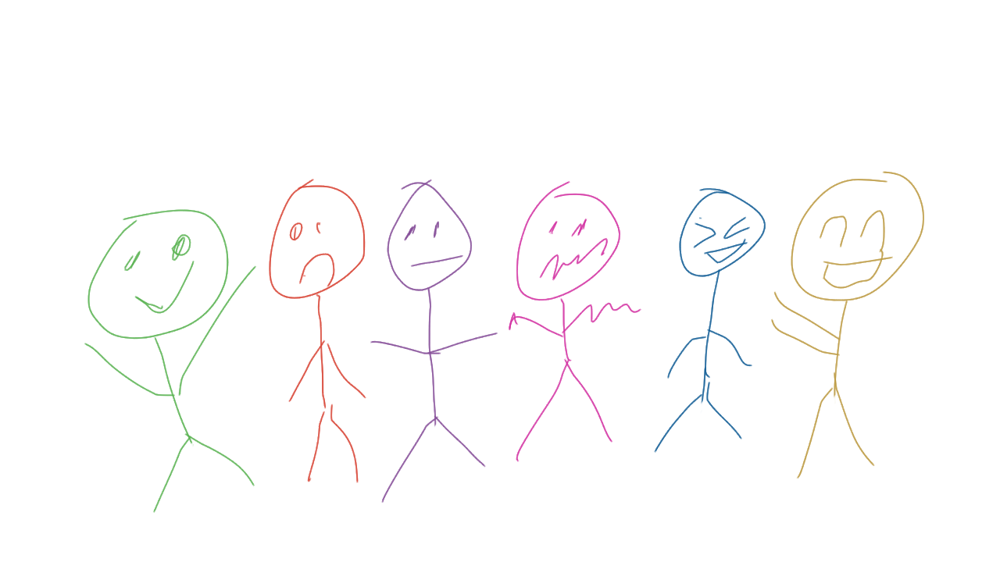
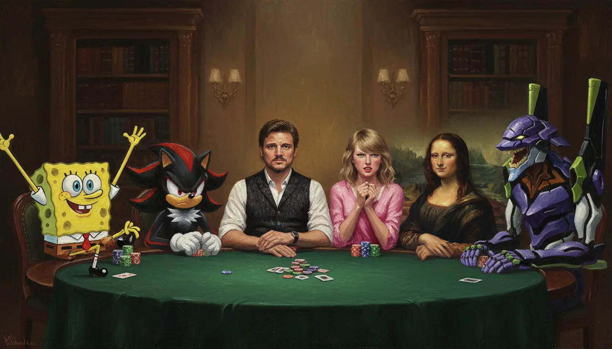

# gemimg

gemimg is a lightweight (<400 LoC) Python package for easily interfacing with Google's Gemini API and the Gemini 2.5 Flash Image (a.k.a. Nano Banana) with robust features. This tool allows for:

- Create images with only a few lines of code!
- Handles image I/O, including multiimage I/O and encoding/decoding.
- Optimized workflows which minimize the amount of tokens used, reducing costs and latency.

Here's some fun, hackable examples on how simpleaichat works:

- Creating a [Python coding assistant](examples/notebooks/simpleaichat_coding.ipynb) without any unnecessary accompanying output, allowing 5x faster generation at 1/3rd the cost. ([Colab](https://colab.research.google.com/github/minimaxir/simpleaichat/blob/main/examples/notebooks/simpleaichat_coding.ipynb))
- Allowing simpleaichat to [provide inline tips](examples/notebooks/chatgpt_inline_tips.ipynb) following ChatGPT usage guidelines. ([Colab](https://colab.research.google.com/github/minimaxir/simpleaichat/blob/main/examples/notebooks/chatgpt_inline_tips.ipynb))
- Async interface for [conducting many chats](examples/notebooks/simpleaichat_async.ipynb) in the time it takes to receive one AI message. ([Colab](https://colab.research.google.com/github/minimaxir/simpleaichat/blob/main/examples/notebooks/simpleaichat_async.ipynb))
- Create your own Tabletop RPG (TTRPG) setting and campaign by using [advanced structured data models](examples/notebooks/schema_ttrpg.ipynb). ([Colab](https://colab.research.google.com/github/minimaxir/simpleaichat/blob/main/examples/notebooks/schema_ttrpg.ipynb))

## Installation

gemimg can be installed [from PyPI](https://pypi.org/project/gemimg/):

```sh
pip3 install gemimg
```

```sh
uv pip install gemimg
```

## Demo

You can demo chat-apps very quickly with simpleaichat! First, you will need to get a Gemini API key (from a project which has billing information)L

```py3
from gemimg import GemImg

g = GemImg(api_key="AI...")
```

You can also pass the API key by storing it in an `.env` file with a `GEMINI_API_KEY` field in the working directory (recommended), or by setting the environment variable of `GEMINI_API_KEY` directly to the API key.

Now, you can generate images with a simple text prompt!

```py3
gen = g.generate("A kitten with prominent purple-and-green fur.")
```

The generated image is stored as a `PIL.Image` object and can be retrieved for example with `gen.image` for passing again to Gemini 2.5 Flash Image for further edits. By default, `generate` also automatically saves the generated image as a PNG file in the current working directory. You can save a WEBP instead by specifying `webp=True`, change the save directory by specifying `save_dir`, or disable the saving behavior with `save=False`.

Due to Gemini 2.5 Flash Image's multimodal text encoder, you can create nuanced prompts including details and positioning that are not as effective Flux or Midjourney:

```py3
prompt = """
Create an image of a three-dimensional pancake in the shape of a skull, garnished on top with blueberries and maple syrup.
"""

gen = g.generate(prompt)
```


Gemini 2.5 Flash Image allows you to make highly-nuanced edits to images. With gemimg, you can pass along the image you just generated very easily for editing.

```py3
edit_prompt = """
Make ALL of the following edits to the image:
- Put a strawberry in the left eye socket.
- Put a blackberry in the right eye socket.
- Put a mint garnish on top of the pancake.
- Change the plate to a plate-shaped chocolate-chip cookie.
- Add happy people to the background.
"""

gen_edit = g.generate(edit_prompt, gen.image)
```


You can also input two (or more!) images/image paths to do things like combine images or put the object from Image A into Image B.

You can also guide the generation with an input image, similar to [ControlNet](https://github.com/lllyasviel/ControlNet) implementations. As an example, given this input drawing and prompt:



```txt
Generate an image of characters playing a poker game sitting at a green felt table, directly facing the front. This new image MUST map ALL of the following characters to the poses and facial expressions represented by the specified colors of the provided image:
- Green: Spongebob SquarePants
- Red: Shadow the Hedgehog
- Purple: Pedro Pascal
- Pink: Taylor Swift
- Blue: The Mona Lisa
- Yellow: Evangelion Unit-01 from "Neon Genesis Evangelion"

The image is an award-winning highly-detailed painting, oil on oaken canvas. All characters MUST adhere to the oil on oaken canvas artistic style, even if this varies from their typical styles. All characters must be present individually in the image.
```



## Gemini 2.5 Flash Image Model Limitations

- Gemini 2.5 Flash Image does not support aspect ratio control, despite developer examples implying such. Prompt engineering the text to generate in a specific ratio does _not_ have any effect. The only method to control the aspect ratio is to provide it as an input image, as the generated image tends to follow the same aspect ration.
- Gemini 2.5 Flash Image cannot do style transfer, e.g. `turn me into Studio Ghibli`, and seems to ignore commands that try to do so. Google's developer documentation example of style transfer unintentionally demonstrates this by incorrectly applying the specified style.
- Gemini 2.5 Flash Image does have moderation in the form of both prompt moderation and post-generation image moderation, although it's more leient than typical for Google's services. In the former case, the `gen.text` will indicate the refusal reason. In the latter case, a `PROHIBITED_CONTENT` error will be thrown.
- Gemini 2.5 Flash Image is unsurprisingly bad at free-form text generation, both in terms of text fidelity and frequency of typos. However, a workaround is to provide the rendered text as an input image, and ask the model to composite it with another image.

## Miscellaneous Notes

- gemimg is intended to be bespoke and very tightly scoped. **Support for other image generation APIs and/or endpoints will not be supported**, unless they follow the identical APIs (i.e. a hypothetical `gemini-3-flash-image`). As this repository is designed to be future-proof, there likely will not be many updates other than compatability fixes.
- gemimg intentionally does not support true multiturn conversations within a single thread as a) the technical lift for doing so would no longer make this package lightweight and b) it is unclear if it's actually better for the typical use cases.
- Do not question my example image prompts. I assure you, there is a specific reason or test for every model input and prompt engineering trick. There is a method to my madness, although in this case it may be more madness than method.

## Roadmap

- Async support (for parallel calls and [FastAPI](https://fastapi.tiangolo.com) support)
- Additional model parameters if the Gemini API supports them.

## Maintainer/Creator

Max Woolf ([@minimaxir](https://minimaxir.com))

_Max's open-source projects are supported by his [Patreon](https://www.patreon.com/minimaxir) and [GitHub Sponsors](https://github.com/sponsors/minimaxir). If you found this project helpful, any monetary contributions to the Patreon are appreciated and will be put to good creative use._

## License

MIT
